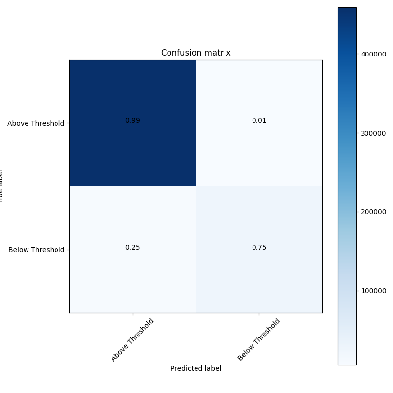
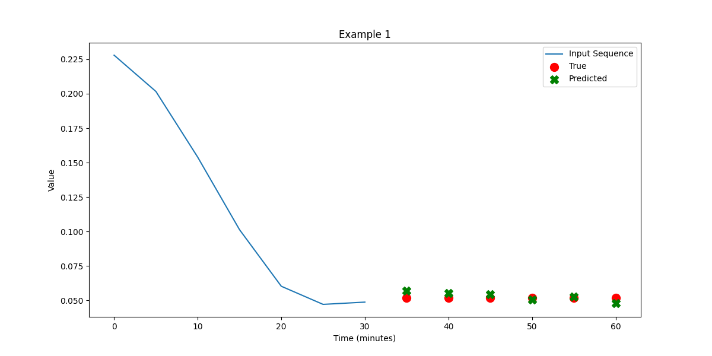

## Model description

In the realm of sequence-to-sequence tasks, Attention Networks have garnered attention (pun intended) for their ability to focus on specific parts of the input when generating the output, much like how humans pay attention to specific portions of input when performing tasks like reading or listening. This is particularly useful in time-series prediction tasks like CGM data forecasting, where not all past data points are equally informative for predicting future glucose levels. By weighing the importance of different input data points, Attention Networks aim for more accurate and interpretable predictions.

The best hyperparameters after optimization are the following:
| Hyperparameter         | Value      |
|------------------------|------------|
| head_size              | 448        |
| num_heads              | 1          |
| ff_dim                 | 480        |
| num_transformer_blocks | 6          |
| mlp_units              | [352, 352] |
| mlp_dropout            | 0.0        |
| dropout                | 0.0        |

## More results

Aside from the scores reported [in the overview](https://francesco-vaselli.github.io/GlucoseGuard/overview1/), we show here the Confusion Matrix and a regression example for our network

TODO add loss curves