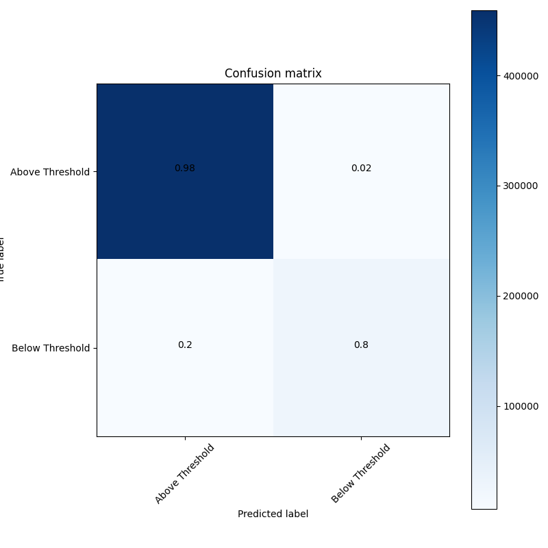
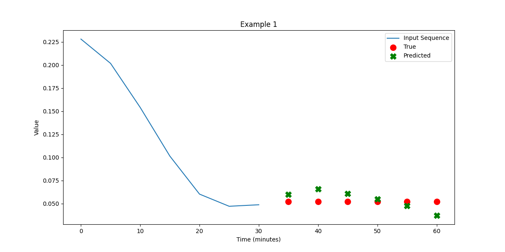
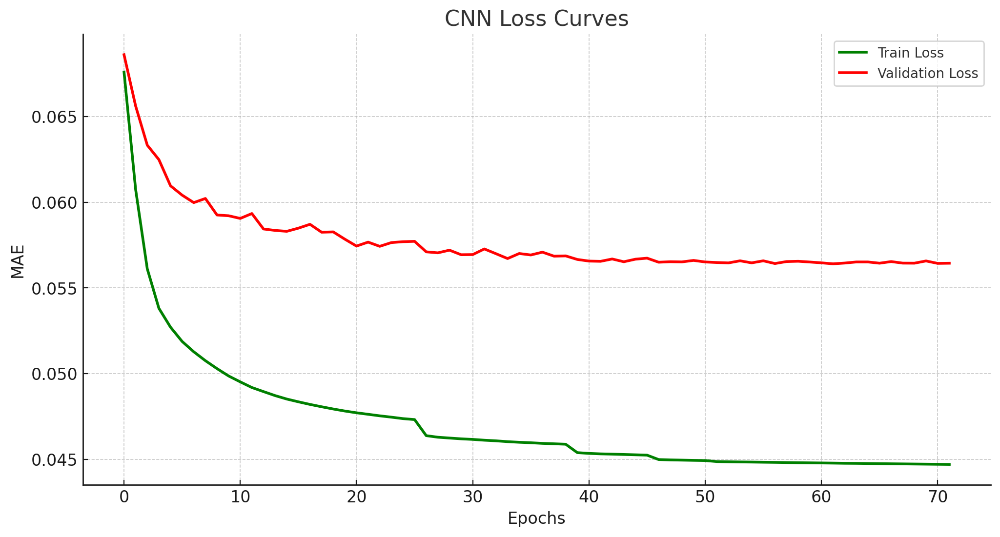

## Model description

Convolutional Neural Networks (CNNs) have been a cornerstone in image recognition tasks but have also found utility in time-series analysis. The main idea behind a CNN is the use of convolutional layers that automatically and adaptively learn spatial hierarchies of features. In the context of CGM data, CNNs can capture spatial (time-adjacent) dependencies in the glucose measurements, making them well-suited for forecasting tasks.

The best hyperparameters after optimization are the following:

| Hyperparameter  | Value |
|-----------------|-------|
| n_conv_layers   | 3     |
| filters         | 160   |
| kernel_size     | 3     |
| activation      | relu  |
| n_dense_layers  | 2     |
| dense_size      | 352   |

## More results and loss curves

Aside from the scores reported [in the overview](https://francesco-vaselli.github.io/GlucoseGuard/overview1/), we show here the Confusion Matrix and a regression example for our network

