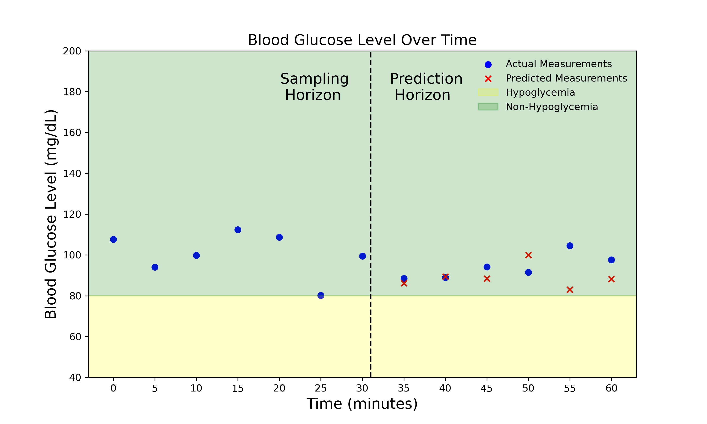

# GlucoseGuard

## Introduction 

The following pages describe my[^1] project for the [Statistical and Machine Learning Models for Time Series Analysis](https://www.sns.it/en/corsoinsegnamento/statistical-and-machine-learning-models-time-series-analysis) PhD Exam.

The reliable prediction of glucose levels in diabetes patients remains a pivotal challenge in biomedical engineering and healthcare informatics. Traditional predictive models have often suffered from inaccuracies and an inability to generalize across different physiological characteristics inherent in patient-specific data. The implications of these shortcomings are nontrivial and bear significant ramifications for clinical decision-making.
In the following, we start from a reference paper and we try to reproduce and expand the work already done, to achieve accurate and robust time series forecasting for blood sugar levels prediction.

The problem is illustrated in the Figure below. We have a series of Blood Glucose Readings at 5 minutes timestamps. We take as input the values of the previous half-hour ("Sampling Horizon") and perform a regression on the following half-hour values ("Prediciton Horizon"). We can also treat the problem as a classification by looking at where our predictions fall: either above or below the *Hypoglicemia* threshold (80 mg/dL).

## Acknowledgments

We acknowledge the use of the [OpenAPS Data Commons](https://openaps.org/outcomes/data-commons/) dataset, and we would like to publicly thank the authors and the contributors for the effort of gathering so many real-world patient data and making them accessible.

We acknowledge the use of the [OhioT1DM](http://ceur-ws.org/Vol-2675/paper11.pdf) dataset for comparison with the reference paper, and we thank the University of Ohio for granting us access to the dataset.

Part of the codebase is inspired from [AccurateBG](https://github.com/yixiangD/AccurateBG/tree/main) which is released under MIT license

## Literature reference

The research paper selected as a starting point is ["Deep Transfer Learning and Data Augmentation Improve Glucose Levels Prediction in Type 2 Diabetes Patients"](https://www.nature.com/articles/s41746-021-00480-x) by Yixiang Deng et al. The paper proposes a state-of-the-art methodology to address longstanding challenges in predicting glucose levels for diabetes patients.

### Background and Significance

The reliable prediction of glucose levels in diabetes patients remains a pivotal challenge in biomedical engineering and healthcare informatics. Traditional predictive models have often suffered from inaccuracies and an inability to generalize across different physiological characteristics inherent in patient-specific data. The implications of these shortcomings are nontrivial and bear significant ramifications for clinical decision-making.

### Methodological Innovations

The research paper introduces a robust approach that deploys deep transfer learning and data augmentation techniques to ameliorate the inherent challenges in existing models. Deep transfer learning allows the model to benefit from pre-trained networks, thereby reducing the need for extensive datasets. Data augmentation, on the other hand, mitigates the challenges posed by data imbalance by generating synthetic data points for under-represented glucose events, such as spikes or drops.

### Findings

The model proposed by Deng et al. has achieved a predictive accuracy exceeding 95%. This high level of accuracy has profound implications for real-time monitoring systems and clinical practices. It offers the potential for more personalized healthcare interventions and significantly reduces the risks associated with erratic glucose levels. Due to the *unbalanced* nature of the problem, where hypoglycemic events are a fraction of the dataset, other predictive measures become important. In particular, the *precision* $\frac{TP}{TP+FP}$ and the *sensitivity* $\frac{TP}{TP+FN}$ of the best model proposed in the paper are 67.68% and 59.19%, showing that there is still room for improvement.

[^1]: Francesco Vaselli, PhD candidate at Scuola Normale Superiore, francesco.vaselli at sns.it