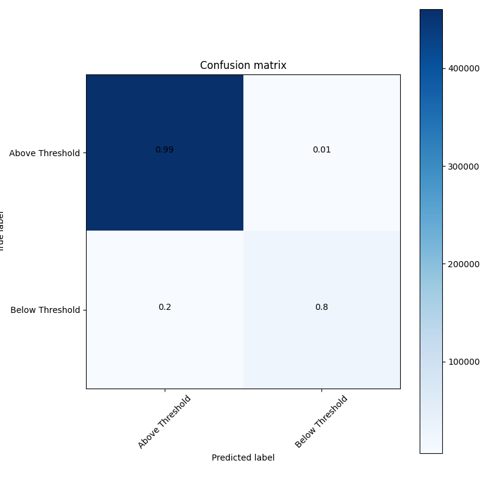
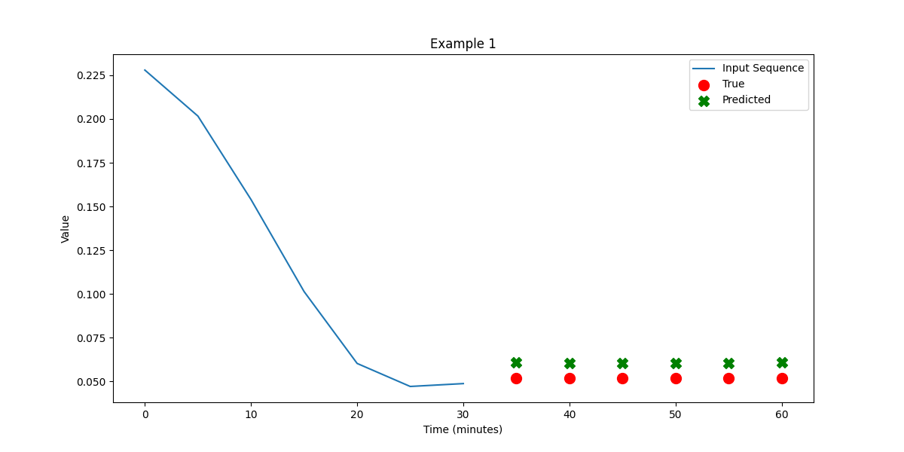

## Model description

Recurrent Neural Networks (RNNs) excel in handling sequential data, making them a natural fit for time-series forecasting tasks like CGM data prediction. However, vanilla RNNs suffer from vanishing and exploding gradient problems, making it difficult for them to capture long-range dependencies in the data. Enter LSTMs—these specialized units are capable of learning such long-term dependencies by maintaining a "cell state" that can be updated and queried as the network processes sequences. This makes LSTMs well-suited for complex time-series tasks where the relationship between past and future points is crucial.

The best hyperparameters after optimization are the following:

| Hyperparameter  | Value |
|-----------------|-------|
| n_rnn_layers    | 1     |
| rnn_units       | 224   |
| n_dense_layers  | 2     |
| dense_size      | 64    |

## More results

Aside from the scores reported [in the overview](https://francesco-vaselli.github.io/GlucoseGuard/overview1/), we show here the Confusion Matrix and a regression example for our network

